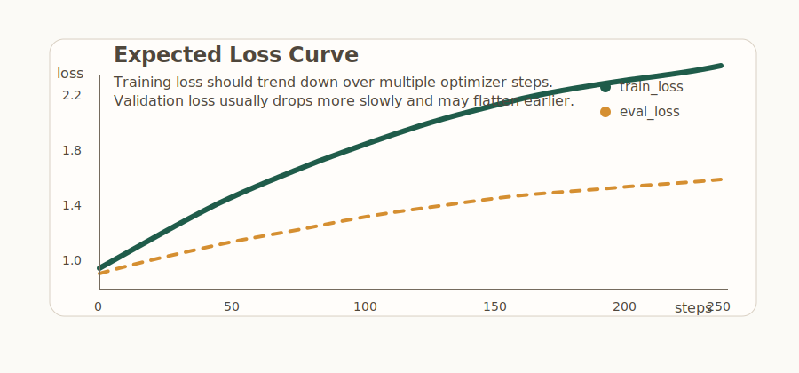

# open-model-v1

A clean, minimal starter repo for supervised fine-tuning a small open-weight language model with LoRA or QLoRA.

This v1 project is meant to be easy to read and easy to extend. It focuses on a simple workflow:

1. Start with raw JSONL training data.
2. Optionally download a small open instruction sample.
3. Curate the raw data into keep/review sets with quality metadata.
4. Build a balanced chat-core dataset from curated sources.
5. Convert it into processed train and validation datasets aligned with the base model tokenizer.
6. Fine-tune a small instruct model with LoRA or QLoRA.
7. Save checkpoints and a final adapter.
8. Run quick evaluation prompts or open a local terminal chat loop.

## What This Repo Does

- Uses Python and Hugging Face tooling.
- Defaults to `Qwen/Qwen2.5-1.5B-Instruct` as the base model.
- Supports raw training examples in this format:

```json
{"instruction":"...", "input":"...", "output":"..."}
```

- Prepares a processed training file with:
  - `prompt`
  - `completion`
- Adds a curation stage with:
  - `task_type`
  - `language`
  - `quality_score`
  - `flags`
  - `source`
  - `action`
- Fine-tunes with:
  - `transformers`
  - `datasets`
  - `peft`
  - `trl`
  - `bitsandbytes` for 4-bit QLoRA where supported

## Project Layout

```text
open-model-v1/
  .github/
    workflows/
      ci.yml
  .pre-commit-config.yaml
  LICENSE
  data/
    curated/
      curation_report.json
      train_curated.jsonl
      review_candidates.jsonl
      chat_vi_en_seed_curated.jsonl
      chat_core_vi_en_train.jsonl
    raw/
      chat_vi_en_seed.jsonl
      sample.jsonl
      train.jsonl
    processed/
      train_sft.jsonl
      val_sft.jsonl
  docs/
    expected-loss-curve.svg
  src/
    __init__.py
    build_dataset.py
    curate_data.py
    download_sample_data.py
    prepare_data.py
    train_lora.py
    merge_adapter.py
    eval.py
    chat.py
    utils.py
  configs/
    rtx4060ti_8gb.yaml
    a100_40gb.yaml
  outputs/
  .gitignore
  pyproject.toml
  README.md
  requirements-dev.txt
  requirements.lock
  requirements.txt
```

## Environment Setup

### 1. Create a virtual environment

From the repo root:

```bash
python -m venv .venv
```

Activate it:

```bash
# PowerShell
.venv\Scripts\Activate.ps1
```

```bash
# macOS / Linux
source .venv/bin/activate
```

### 2. Install dependencies

```bash
pip install --upgrade pip
pip install -r requirements.txt
```

If you are training on GPU, install the correct PyTorch build for your CUDA version from the official PyTorch install page first, then run:

```bash
pip install -r requirements.txt
```

If you want a fully pinned environment from this repo snapshot:

```bash
pip install -r requirements.lock
```

`requirements.lock` is a fully pinned snapshot of the current Python 3.11 development environment. For the most portable install path across machines, keep using `requirements.txt`.

CLI scripts accept `--log_level DEBUG|INFO|WARNING|ERROR|CRITICAL`. The default keeps output terse, while `DEBUG` dumps tokenizer and model config details that are useful when validating a run.

For local automation, this repo also includes optional [pre-commit](https://pre-commit.com/) hooks for `ruff` and `black`.

### 3. Windows PowerShell note

On Windows, the most reliable way to run the training and inference scripts is to call the repo virtualenv interpreter directly:

```powershell
.\.venv\Scripts\python.exe -u -X utf8 src\train_lora.py --config configs\rtx4060ti_8gb.yaml
```

The `-u` flag keeps logs unbuffered so startup and progress messages appear immediately. The training script also re-execs itself in UTF-8 mode on Windows when needed, but using `-X utf8` explicitly keeps the terminal behavior predictable.

## Data Preparation

For a meaningful first fine-tune, download a small public instruction sample into `data/raw/train.jsonl`:

```bash
python src/download_sample_data.py
```

On Windows PowerShell, the equivalent is:

```powershell
.\.venv\Scripts\python.exe -X utf8 src\download_sample_data.py
```

By default this downloads 1,000 rows from `databricks/databricks-dolly-15k` and normalizes them into the repo's raw-data schema. The original three hand-written examples now live at `data/raw/sample.jsonl` for smoke tests, while `data/raw/chat_vi_en_seed.jsonl` contains curated bilingual seed examples for chatbox-core behavior.

Put your raw source data in `data/raw/train.jsonl`. The new default workflow does not train from raw directly.

Expected format per line:

```json
{"instruction":"Explain LoRA simply.", "input":"", "output":"LoRA trains small adapter weights instead of updating the full model."}
```

Run curation first:

```bash
python src/curate_data.py
```

This writes:

```text
data/curated/train_curated.jsonl
data/curated/review_candidates.jsonl
data/curated/curation_report.json
```

Then build the final chat-core dataset:

```bash
python src/build_dataset.py
```

This writes:

```text
data/curated/chat_core_vi_en_train.jsonl
```

Then prepare the SFT dataset:

```bash
python src/prepare_data.py
```

This writes:

```text
data/processed/train_sft.jsonl
data/processed/val_sft.jsonl
```

The curated files keep the original fields plus metadata such as `task_type`, `language`, `quality_score`, `flags`, `source`, and `action`. The built dataset balances Vietnamese, English, and mixed-language chat-core tasks with deterministic sampling. The processed files then add model-ready `prompt` and `completion` fields built with the base model tokenizer. Validation splitting is deterministic by hash and defaults to `--val_ratio 0.05`.

If you only want a tiny smoke test on the hand-written examples:

```bash
python src/prepare_data.py --input_path data/raw/sample.jsonl --val_ratio 0
```

If you want to prepare data for a different base model:

```bash
python src/prepare_data.py --base_model Qwen/Qwen2.5-0.5B-Instruct
```

If you change the base model, rerun data preparation before training. If you change the curated inputs, rerun both `curate_data.py` and `build_dataset.py` before `prepare_data.py`. Pass `--model_revision` if you want to lock the tokenizer to a specific Hugging Face revision for reproducibility.
If the tokenizer has no pad token, the repo adds a dedicated `<|pad|>` token and resizes the model embeddings so padding stays distinct from EOS. TRL then masks padded positions to `-100` before loss.
`prepare_data.py` downloads the tokenizer from Hugging Face on first run, so the first invocation may take longer than later cached runs.

End-to-end PowerShell example:

```powershell
.\.venv\Scripts\python.exe -X utf8 src\download_sample_data.py
.\.venv\Scripts\python.exe -X utf8 src\curate_data.py
.\.venv\Scripts\python.exe -X utf8 src\build_dataset.py
.\.venv\Scripts\python.exe -X utf8 src\prepare_data.py
```

## Training

Default training command:

```bash
python src/train_lora.py
```

If you want a committed YAML to describe the run:

```bash
python src/train_lora.py --config configs/rtx4060ti_8gb.yaml
```

Recommended Windows PowerShell command:

```powershell
.\.venv\Scripts\python.exe -u -X utf8 src\train_lora.py --config configs\rtx4060ti_8gb.yaml
```

CLI arguments still override the file:

```bash
python src/train_lora.py --config configs/rtx4060ti_8gb.yaml --learning_rate 5e-5
```

This will:

- load the processed train and validation datasets
- load the base model
- use `Qwen/Qwen2.5-1.5B-Instruct`
- default to `max_length=512`, which is a safer starting point for 8 GB GPUs
- enable 4-bit QLoRA by default only on supported non-Windows CUDA setups
- train LoRA adapters
- evaluate on `data/processed/val_sft.jsonl` every `save_steps`
- save checkpoints under `outputs/`
- save the final adapter to:

```text
outputs/qwen2.5_1.5b_lora/final_adapter
```

Preset for your current GPU target:

```bash
python src/train_lora.py --preset rtx4060ti_8gb
```

This preset is tuned for compact instruct models like `Qwen/Qwen2.5-1.5B-Instruct` on GPUs like the RTX 4060 Ti 8 GB and currently applies:

- `max_length=512`
- `per_device_train_batch_size=1`
- `gradient_accumulation_steps=8`
- environment-aware `load_in_4bit`

Example with a few explicit overrides:

```bash
python src/train_lora.py ^
  --num_train_epochs 1 ^
  --max_length 512 ^
  --per_device_train_batch_size 1 ^
  --gradient_accumulation_steps 8 ^
  --learning_rate 1e-4
```

On macOS or Linux shells:

```bash
python src/train_lora.py \
  --num_train_epochs 1 \
  --max_length 512 \
  --per_device_train_batch_size 1 \
  --gradient_accumulation_steps 8 \
  --learning_rate 1e-4
```

If you want to disable 4-bit loading:

```bash
python src/train_lora.py --load_in_4bit false
```

That is mainly useful for debugging or environments where `bitsandbytes` is not available. On native Windows, this starter now defaults to full-precision loading unless you explicitly opt into 4-bit yourself.
When that Windows fallback is chosen implicitly, the script now prints an explicit banner so you can see that the run is not using QLoRA.
The script also prints a startup banner before importing the heavier ML stack so you can tell immediately that the process has launched.

Reproducibility knobs:

```bash
python src/train_lora.py --seed 42
python src/train_lora.py --model_revision <hf-commit-or-tag>
```

Metric logging is optional and stays off by default:

```bash
python src/train_lora.py --report_to tensorboard
python src/train_lora.py --report_to wandb
```

If `data/processed/val_sft.jsonl` is missing or empty, training skips evaluation automatically. That keeps `data/raw/sample.jsonl` usable for quick smoke tests.

If you switch to a gated base model, log in first:

```bash
huggingface-cli login
```



## Adapter Merging

Merge the trained adapter into the base model so the result can run with `transformers` alone:

```bash
python src/merge_adapter.py
```

This step is optional. `chat.py` and `eval.py` can load the base model plus the LoRA adapter directly without merging first.

By default this reads `outputs/qwen2.5_1.5b_lora/final_adapter` and writes `outputs/qwen2.5_1.5b_lora/merged`.

The `outputs/qwen2.5_1.5b_lora/README.md` file you may see after training is the model card autogenerated by Hugging Face tooling for the adapter/checkpoint artifact.

## Evaluation

Run a quick inference smoke test with built-in prompts:

```bash
python src/eval.py
```

Windows PowerShell:

```powershell
.\.venv\Scripts\python.exe -X utf8 src\eval.py
```

This loads the base model plus the saved adapter and prints a few sample generations to the terminal.
Like training, 4-bit loading only turns on by default when the local environment supports it.
Evaluation also accepts `--seed` and `--model_revision` for reproducible sampling against the pinned base model snapshot.

If you want the matching evaluation preset:

```bash
python src/eval.py --preset rtx4060ti_8gb
```

If your adapter is saved somewhere else:

```bash
python src/eval.py --adapter_path outputs/qwen2.5_1.5b_lora/final_adapter
```

## Local Chat

Start a simple terminal chat loop:

```bash
python src/chat.py
```

Windows PowerShell:

```powershell
.\.venv\Scripts\python.exe -X utf8 src\chat.py
```

This v1 chat loop is intentionally simple:

- it loads the base model plus adapter
- it keeps a short multi-turn history in memory
- it supports `/reset` and `/system <prompt>`
- it trims older turns automatically with `--max_history_turns`
- it is still useful for quick local testing, not production serving
- it follows the same environment-aware 4-bit default as the training and eval scripts
- it wraps each user turn into the same `Instruction:` format used during SFT preparation so chat-time prompts match train-time prompts more closely

If you want the matching chat preset:

```bash
python src/chat.py --preset rtx4060ti_8gb
```

Type `exit` or `quit` to stop.

## Web Chat App

This repo now includes a ChatGPT-style internal MVP with:

- a `FastAPI` backend under `src/server/`
- a `Next.js` frontend under `web/`
- local conversation storage in SQLite
- streaming assistant replies over `SSE`

### Run the backend

From the repo root:

```powershell
.\.venv\Scripts\python.exe -m uvicorn src.server.app:app --reload
```

Optional environment variables:

- `OPEN_MODEL_BASE_MODEL`
- `OPEN_MODEL_ADAPTER_PATH`
- `OPEN_MODEL_MODEL_REVISION`
- `OPEN_MODEL_LOAD_IN_4BIT`
- `OPEN_MODEL_DB_PATH`
- `OPEN_MODEL_CORS_ORIGINS`

If `OPEN_MODEL_ADAPTER_PATH` is not set, the API tries `outputs/qwen2.5_1.5b_lora/final_adapter` first and falls back to the base model if no adapter is present.

### Run the frontend

In a second terminal:

```powershell
cd web
npm install
npm run dev
```

If your API is not on `http://127.0.0.1:8000`, set:

```powershell
$env:NEXT_PUBLIC_API_BASE_URL="http://127.0.0.1:8000"
```

Then open:

```text
http://localhost:3000
```

## Common Troubleshooting

### `bitsandbytes` install or runtime errors

- Native Windows support can be inconsistent.
- The cleanest path for QLoRA is Linux or WSL with an NVIDIA GPU.
- If you only want to test the code path, try:

```bash
python src/train_lora.py --load_in_4bit false
```

### CUDA out-of-memory

- Start with fewer examples.
- Lower `--max_length`.
- Keep `--per_device_train_batch_size 1`.
- Increase `--gradient_accumulation_steps`.
- On 8 GB GPUs, start with the default `--max_length 512` and only raise it after a successful run.

### Tokenizer or prompt mismatch after changing models

- Rerun:

```bash
python src/prepare_data.py --base_model <your-model>
```

- Then train again with the same base model name.

### Training data errors

Each JSONL row must include:

- `instruction` as a non-empty string
- `output` as a non-empty string
- `input` may be empty

If you use the curated pipeline, review rows are written separately and should not be fed directly into training.

### Very slow CPU inference

- This starter is designed mainly for GPU experimentation.
- CPU runs can still work for smoke tests, but they will be slow.

## Security Notes

- This repo keeps `trust_remote_code=False` in the model-loading paths.
- Treat `data/raw/` as sensitive local input. Do not put PII, secrets, or proprietary data there unless you are intentionally working in a secure environment.
- Review any third-party dataset or base model license before redistribution of derived artifacts.

## Notes For Extending Later

Good next steps after this v1:

- expose inference behind a small FastAPI service
- support DPO or preference tuning later

This repo is intentionally not that yet. It is the first working version.
